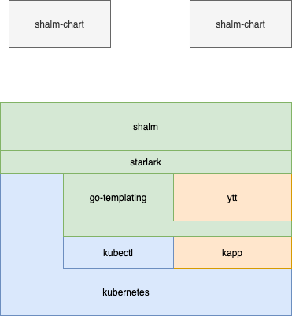

# Scriptable helm charts

This project brings the starlark scripting language to helm charts.

## Features

* Ease orchestration of deployments
* Strict separation of templates and logic
* Define APIs for helm charts
* Control deployment by overriding methods
* Compatible with helm
* Use starlark methods in templates (replacement for `_helpers.tpl`)
* Interact with kubernetes during installation
* Manage user credentials
* Manage certificates
* Act as glue code between helm charts
* Rendering of [ytt templates](https://get-ytt.io/)
* Also available as kubernetes controller
* Easy embeddable and extendable
* Integration of [kapp](https://github.com/k14s/kapp)

## Installation

Installing shalm can be done in [various ways](doc/installation.md)

## Architecture

## Usage

How to start shalm from the command line is described [here](doc/command_line.md)

## Getting started

There is a [small tutorial](doc/getting_started.md) available.

## User Guide

Solutions for a set of problems are shown [here](doc/user_guide.md)

## Repos

Shalm can load charts from a [various set of locations](doc/repos.md).

## Kubernetes Controller

Shalm can also run as [controller](doc/controller.md) inside a kubernets cluster

## Reference

A reference for the complete [shalm starlark API](doc/reference.md)

## Testing

Shalm also supports [unit testing](doc/unit_tests.md)

## Comparison

|                                | shalm           | helm  | ytt/kapp | kustomize |
|--------------------------------|-----------------|-------|----------|-----------|
| Scripting                      | +               | (3.1) | +        | -         |
| API definition                 | +               | -     | (+)      | -         |
| Reuse of existing charts       | +               | +     | (+)      | ?         |
| Only simple logic in templates | +               | +     | -        | +         |
| Interaction with k8s           | +               | +     | -        | -         |
| Repository                     | +               | +     | -        | -         |
| Mature technology              | -               | +     | +        | +         |
| Manage user credentials        | +               | -     | -        | -         |
| Manage user certificate        | +               | -     | -        | -         |
| Controller based installation  | +               | -     | +        | -         |
| Remove outdated objects        | +(1) | +     | +        | -         |
| Migrate existing objects       | +(1) | -     | -        | -         |

(1): Must be implemented inside `apply` method or by using kapp as installer.

## Difference to helm

* Subcharts are not loaded automatically. They must be loaded using the `chart` command
* Global variables are not supported.
* The `--set` command line parameters are passed to the `init` method of the corresponding chart.
It's not possible to set values (from `values.yaml`) directly.
If you would like to set a lot of values, it's more convenient to write a separate shalm chart.
* `shalm` doesn't track installed charts on a kubernetes cluster (except you are using `kapp` for deployment). It works more like `kubectl apply`
* The `.Release.Name` value is build as follows: `<chart.name>-<chart.suffix>`. If no suffix is given, the hyphen is also ommited.
